# User Guide

This document is a beginner's guide to how to use _FindMyBike_. It contains step-by-step explanations of how the app works along with useful tips for getting the most out of _FindMyBike_.

## Prerequisites

The following are the requirements for using _FindMyBike_

- an iBeacon
- an iPhone running iOS 10 or later
- Bluetooth support enabled (see **Settings**)
- Location Services enabled (see **Settings**)
- Mobile data or WiFi connection

## About iBeacons

_FindMyBike_ uses iBeacons to help you track down your bike. iBeacon is a beacon technology developed by Apple based on Bluetooth Low Energy (BLE) which allows beacons to be detected by a suitable app, such as _FindMyBike_.

### Where can I buy iBeacons?

iBeacons are available from a range of shops and online retailers, including [Amazon](https://www.amazon.co.uk/) and [BeaconZone](https://www.beaconzone.co.uk/).

### Which beacon should I buy?

Any iBeacon that is advertised as supporting the Apple iBeacon standard should be compatible with _FindMyBike_. Most iBeacons comes with instructions on how to configure them, usually by installing an app provided by the manufacturer.

The range of iBeacons varies considerably. We recommend using a beacon marketed as 'long range' for the greatest possible chance of recovering your missing bike.

### How do I configure my iBeacon?

iBeacon identifiers are split into three parts: UUID, major and minor. For _FindMyBike_ to work you must configure the iBeacon to use the following settings:

- UUID: `21EECF71-D5C7-4A00-9B90-27C94B5146EA`
- Major: `1`

The minor component is unique to your bike. You can use any number between 100-65535. Make a note of the number used to input when configuring _FindMyBike_ below.

### What do I do next?

After configuring your iBeacon, attach it securely and discreetly to your bike using the supplied adhesive sticker. Then install and run the _FindMyBike_ app.

## Using _FindMyBike_

### Granting permissions

In order to provide its full capabilities, *FindMyBike* needs permission to access location services and to show you push notifications.

When the app is first run, it prompts asking you to grant the necessary permissions.

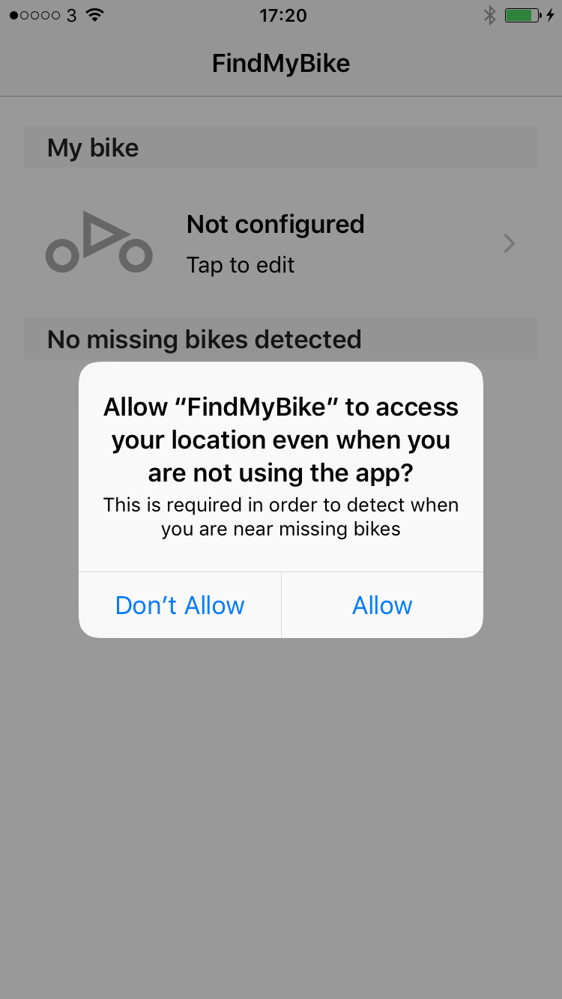
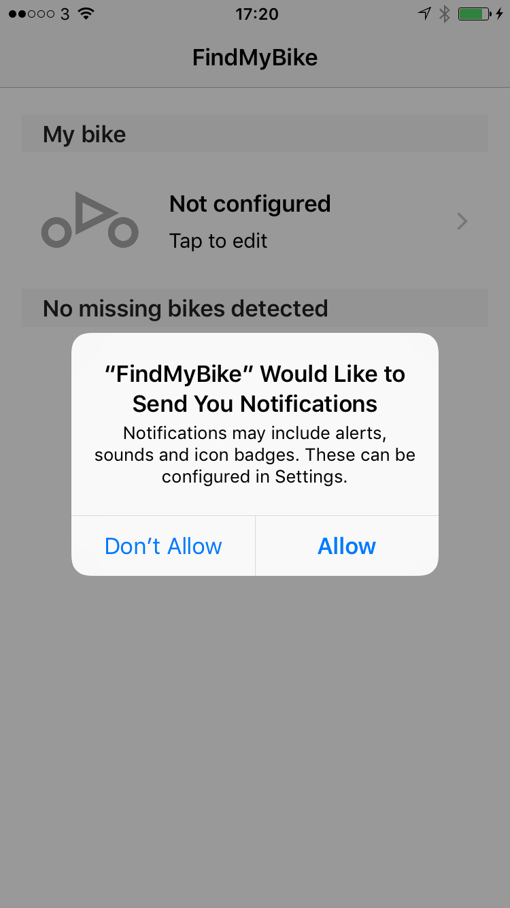

Tap **Allow** in response to these prompts to ensure the app functions correctly. If you do not grant the permissions, some app features will not be available.

> Note: _FindMyBike_ requests access to your location in the background in order to be able to detect iBeacons in your vicinity. It only determines your absolute location when you explicitly ask it to by reporting a missing bike.

### Main screen

After granting the necessary permissions (see above), the **main** screen is displayed:

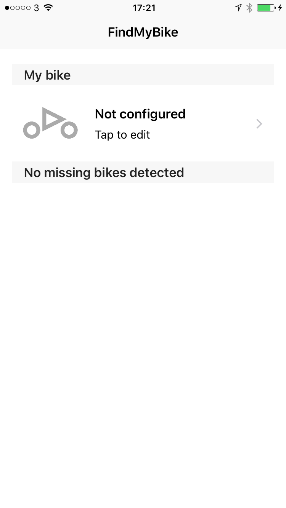

This screen has two sections:

#### My bike

This section shows information about your currently-configured bike. Tap the grey bike icon to enter details of your bike on the **edit bike** screen (see below).

#### Missing bikes

This section will show you details of any missing bikes in your vicinity when they are detected. 

### Edit bike screen

By tapping the 'My bike' section of the main screen, the **edit bike** screen is displayed:

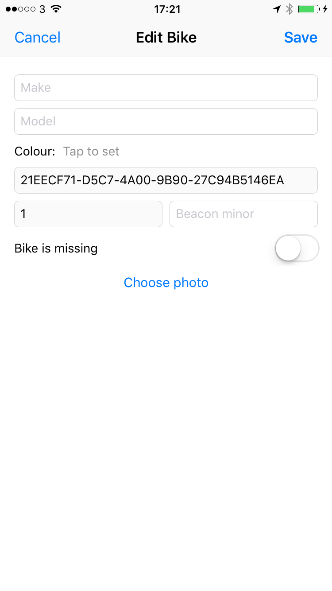

Use this screen to enter information about your bike so that other users will be able to identify it if it is detected.

- _Make_: enter the make of the bike, for example 'Suzuki'
- _Model_: enter the model of the bike, for example 'SV650S'
- _Beacon minor_: enter the beacon 'minor' number for the iBeacon you attached to the bike (see above), for example '101'.
- _Colour_: (optional) to set a colour, tap the words 'Tap to set' next to where it says 'Colour'
- _Photo_: (optional): tap the 'Choose photo' button to add a photo of your bike. You will be prompted for permission to access your photo library. Tap **Allow** to choose a picture.

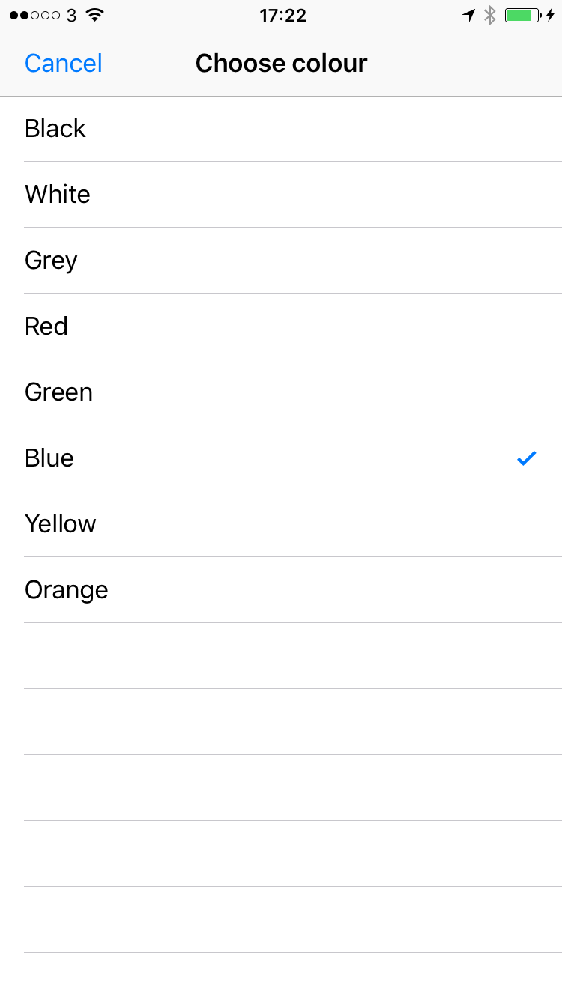

After you have completed all the bike details, tap the 'Save' button to store all the information and upload it to the _FindMyBike_ servers.

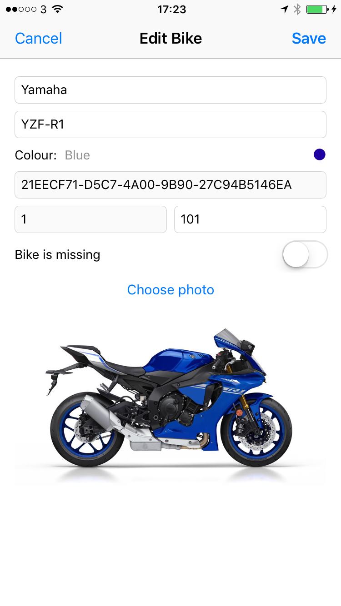

### Detecting missing bikes

After you have run the app for the first time, if you enter an area containing one or more bikes that have been reported as missing, _FindMyBike_ will detect the bike's iBeacon and show an alert in Notifiation Center:

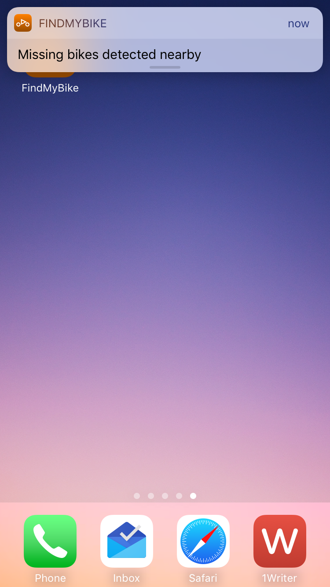

Tap the notification to open `FindMyBike` and view a list of all missing bikes in your vicinity:

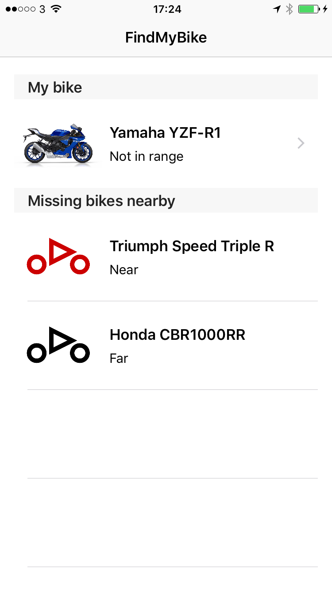

Use the information in the 'Missing bikes nearby' table to help identify the missing bike that has been detected.

> Hint: under the name of each bike, a proximity label shows your relative distance to the bike, either 'Immediate', 'Near', 'Far' or 'Unknown'. If you can see a bike matching the make, model and colour, move closer to it to provide the most accurate report of its location.

If you want to report the location where you deteced the missing bike to its owner, tap the row containing the bike. The following prompt appears:

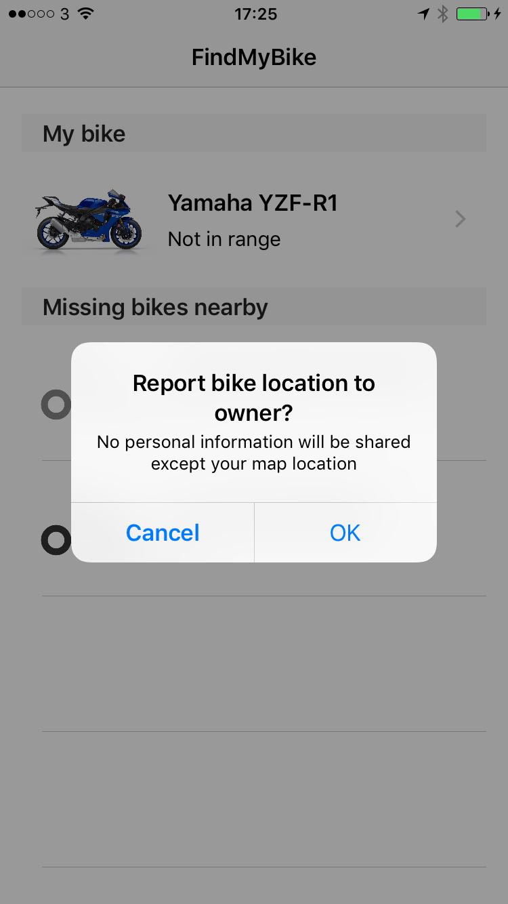

Tap **OK** to send a report of your location to the bike's owner. Tap **Cancel** to return to the main screen without reporting your location.

### Reporting your bike missing

If your bike is missing, tap on the 'My bike' section on the main screen to access the **edit bike** screen, and then activate the 'Bike is missing' switch. An alert will appear informing you that you will receive a push notification if your bike is detected.

> Note: if you did not allow _FindMyBike_ to send you notifications when you installed it, go to the **Settings** app to enable it now.

If the location of your missing bike is detected by another _FinyMyBike_ user, you will receive a notification such as the following:

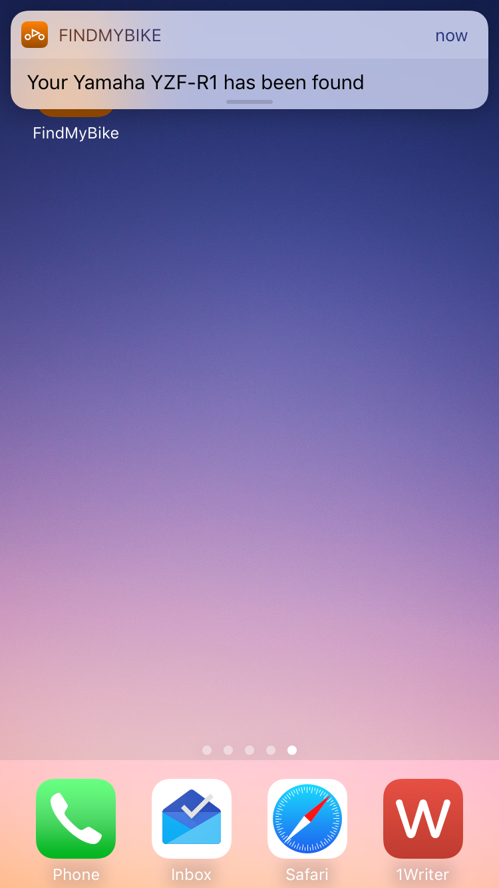

Tap the notification to open the app and you will see the following message:

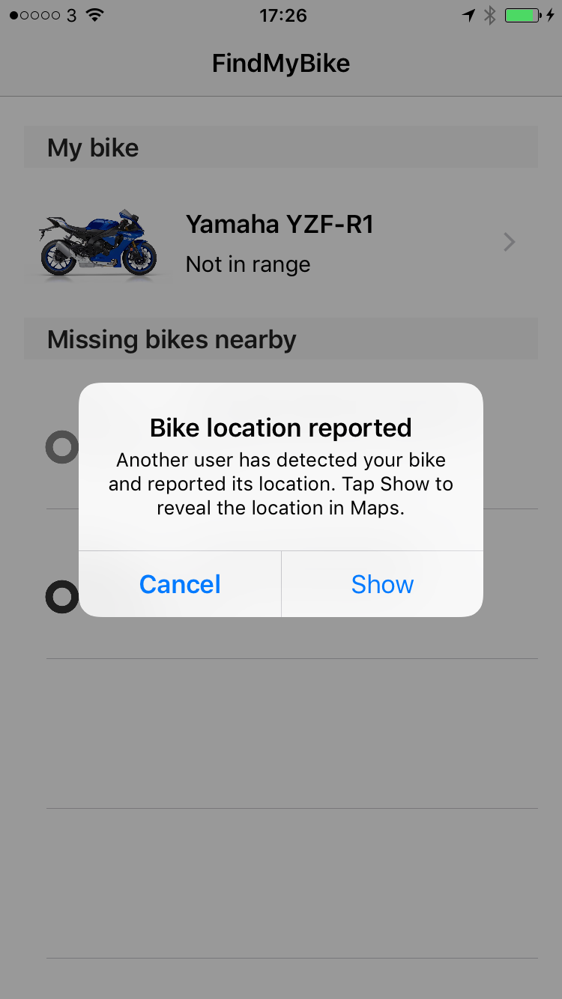

Tap **Show** to reveal the location of your bike using the **Maps** application:

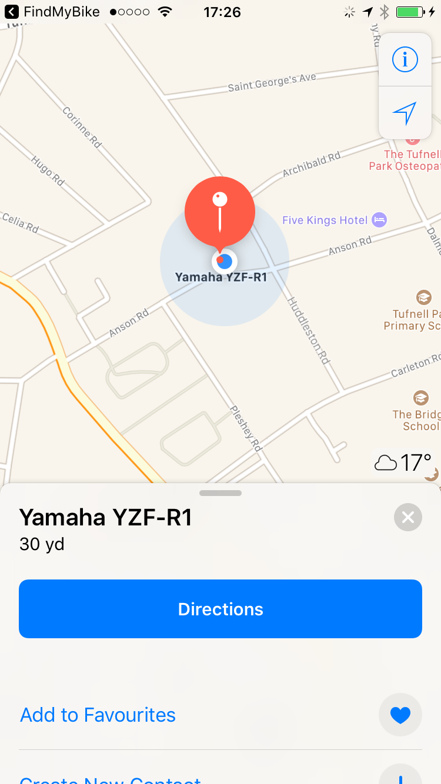

Now go find it!

> Hint: once you have located your bike, remember to disable the 'Bike is missing' option on the **edit bike** screen to avoid receiving further notifications.
